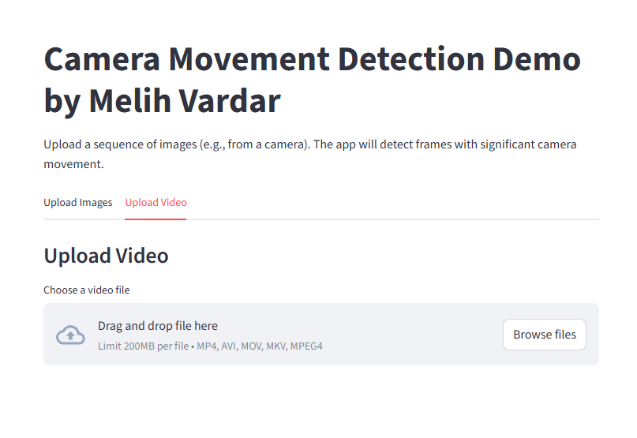
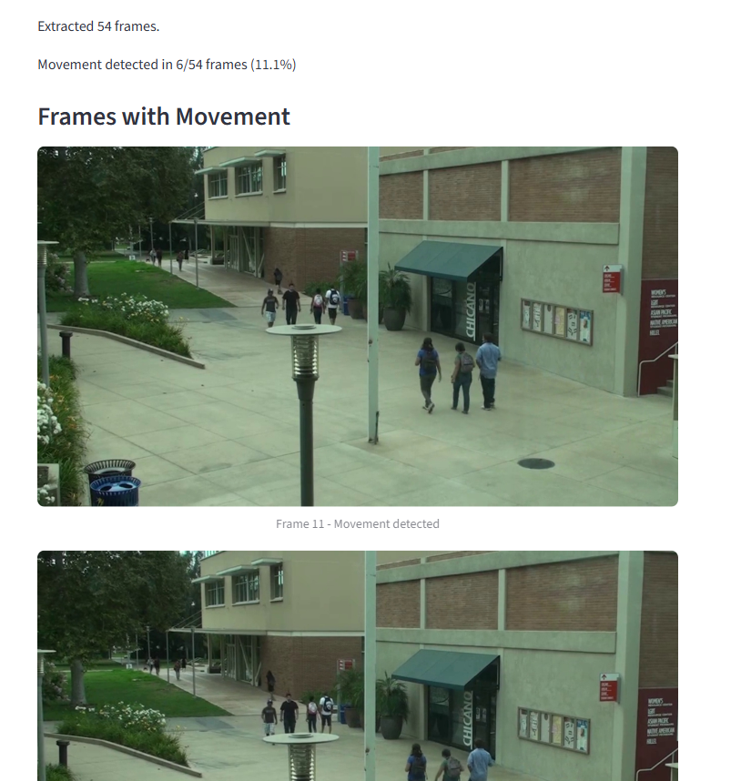

# Camera Movement Detection - ATP Core Talent 2025

**Detecting Significant Camera Movement Using Feature-Based Computer Vision**

---

## 🎯 Overview

This project implements a camera movement detection system that distinguishes between actual camera shake/movement and object movements within the scene. The solution uses advanced computer vision techniques including feature detection, optical flow, and homography analysis.

### Key Features
- **Feature-based detection** using goodFeaturesToTrack + Lucas-Kanade optical flow
- **Camera vs Object movement distinction** through movement consistency analysis
- **Homography-based transformation analysis** for precise movement characterization
- **Web interface** with Streamlit for easy testing and demonstration
- **Video and image sequence support** with intelligent frame sampling

---

## 🔬 Technical Approach

### Algorithm Overview
1. **Feature Detection**: Extract corner features using `cv2.goodFeaturesToTrack()`
2. **Optical Flow**: Track features between frames using Lucas-Kanade method
3. **Homography Estimation**: Calculate geometric transformation using RANSAC
4. **Movement Analysis**: Distinguish camera movement from object movement using:
   - **Inlier Ratio**: Camera movement affects most features globally (>70%)
   - **Movement Consistency**: Camera movement creates consistent feature displacement
   - **Transformation Parameters**: Analyze translation, scale, rotation, and perspective changes

### Core Detection Criteria
- **Translation**: Significant camera pan/tilt (>1.0px + consistency >0.3)
- **Scale Changes**: Zoom in/out detection (>0.02 + consistency >0.3)
- **Rotation**: Camera rotation detection (>0.01 rad + consistency >0.3)
- **Camera Shake**: High movement with very high consistency (>2.0px + >0.5 consistency)

---

## 🚀 How to Run Locally

### Installation
```bash
# Clone the repository
git clone https://github.com/melih-vardar/camera-movement-detection.git
cd camera-movement-detection/camera-movement-detection

# Install dependencies
pip install -r requirements.txt
```

### Running the App
```bash
streamlit run app.py
```

The app will be available at `http://localhost:8501`

### How to Use
1. **Upload Images Tab**: 
   - Select multiple images (JPG, PNG) showing a sequence
   - App will analyze consecutive frames for camera movement
   - View detected movement frames with frame indices

2. **Upload Video Tab**:
   - Upload a video file (MP4, AVI, MOV, MKV)
   - App automatically extracts frames for analysis
   - See percentage of frames with detected movement

---

## 🎨 Live Demo

**🔗 Deployed App**: [Camera Movement Detection Demo](https://cam-movement-detection-mv.streamlit.app/)

---

## 📊 Example Screenshots

### Upload Interface

*Upload multiple images or a video file for camera movement analysis*

### Detection Results

*App shows detected movement frames and frame indices*

---

## 🧠 Development Process

### Key Challenge: Distinguishing Camera vs Object Movement
**Problem**: Basic frame differencing detected any movement, including moving objects.

**Solution**: Implemented feature-based analysis with movement consistency metrics. Camera movement creates consistent feature displacement across the entire frame, while object movement creates localized, inconsistent patterns.

### Algorithm Refinement
Through testing and parameter adjustment, developed a multi-criteria detection system that significantly reduces false positives while maintaining high accuracy for actual camera movements.

### Key Assumptions
- **Sufficient Features**: Algorithm requires at least 10 corner features per frame for reliable detection
- **Frame Quality**: Input frames should have reasonable resolution and contrast for feature detection
- **Sequential Analysis**: Frames are analyzed in sequence, comparing consecutive frames for movement detection
- **Movement Types**: Optimized for detecting pan, tilt, zoom, rotation, and shake movements

---

## 🔧 Technical Implementation

### Key Libraries Used
- **OpenCV**: Computer vision operations
- **NumPy**: Numerical computations
- **Streamlit**: Web interface
- **PIL**: Image processing

### Code Structure
```
├── camera-movement-detection/
│   ├── app.py                 # Streamlit web interface
│   ├── movement_detector.py   # Core detection algorithm
│   ├── requirements.txt       # Dependencies
│   ├── sample_video/         # Test data
│   ├── screenshots/          # Example screenshots
│   ├── README.md             # Project documentation
│   └── README-instructions.md # Challenge instructions
├── README.md                 # Main project documentation
└── README-instructions.md    # Challenge instructions
```

---

**Challenge**: ATP Core Talent 2025  